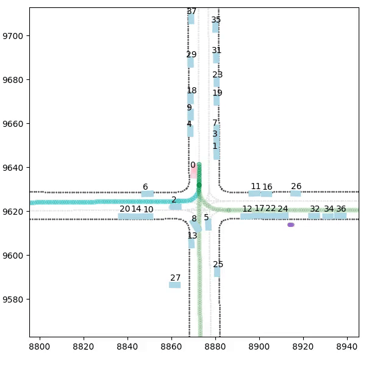

<div align="center">
  
</div>

# V-Max

[](https://opensource.org/licenses/MIT)
[](https://github.com/psf/black)

V-Max is a plug-and-play extension of the [Waymax](https://github.com/waymo-research/waymax) simulator designed for the autonomous driving research community.

It provides a **unified framework** for benchmarking, training, and evaluation of a path planner from BEV to control. It integrates simulation pipelines, observation and action wrappers, and realistic metrics.

<div align="center">
<table>
  <tr>
    <th>Expert</th>
    <th>RL Policy</th>
  </tr>
  <tr>
    <td></td>
    <td></td>
  </tr>
  <tr>
    <td></td>
    <td></td>
  </tr>
</table>
</div>

## Features

- **Unified Simulator Framework**
  - Integrates data from several datasets. Thanks to [ScenarioMax](https://github.com/valeoai/scenariomax), an extension of [ScenarioNet](https://github.com/metadriverse/scenarionet), we build unified TFRecord from WOMD, nuPlan and nuScenes datasets. **SDC Paths are also added to the TFRecord.**

- **Modular Components**
  - **Simulator State & Data Structures:** Encapsulate trajectories, roadgraph features, object metadata, and timestep information.
  - **Observation & Action Wrappers:** Easily configurable wrappers to extract GPS, roadgraph, and other sensor features, and to transform agent outputs into executable actions.
  - **Metrics for Evaluation:** Includes comfort metrics (lateral/longitudinal acceleration, jerk, yaw rate/acceleration), speed-limit evaluation, time-to-collision, red light detection, driving direction compliance, and more.

- **Configurable Training Pipeline**
  - Integrates with Reinforcement Learning (RL) and Imitation Learning (IL) training frameworks managed by Hydra-based configuration files.

- **Flexible Environment Wrappers**
  - Supports interfaces such as Brax-style training wrappers to ensure compatibility with high-performance JAX pipelines.

## Code Structure

```
mini_datasets
├── mini_womd_dataset.tfrecord
├── mini_nuplan_dataset.tfrecord
vmax
├── config
│ ├── base_config.yaml
│ ├── algorithms
│ │ ├── sac.yaml
│ │ ├── bc.yaml
│ │ ├── bc_sac.yaml
│ ├── encoders
│ │ ├── mgail.yaml
│ │ ├── perceiver.yaml
│ │ ├── wayformer.yaml
├── learning
│ ├── algorithms
│ ├── networks
│ ├── pipeline
├── simulator
│ ├── features
│ ├── metrics
│ ├── overrides
│ │ └── visualization
│ ├── wrappers
│ ├── action
│ └── environment
├── scripts
│ ├── train.py
│ ├── evaluate.py
└── README.md
```

## ScenarioMax

**ScenarioMax** is a core feature of V-Max that enhances our data with **SDC paths**. These paths are crucial for calculating targets, rewards, and various metrics during simulation.

Key objectives:
- **Enrich Data:** By incorporating SDC paths, ScenarioMax helps improve the precision of target computations, reward evaluations, and metric calculations.
- **Unified Dataset:** It consolidates data from different autonomous driving (AD) datasets into a single, standardized format, similar to the approaches found in [ScenarioNet](https://github.com/metadriverse/scenarionet).

For those who prefer to run V-Max without the complete ScenarioMax integration, a lightweight wrapper is available. This wrapper generates one single SDC path at every scenario reset. Keep in mind that while this approach simplifies testing, it increases computational overhead and may not always produce an SDC path that perfectly matches the ground truth.

**Mini datasets (around 1000 scenarios each) are provided in the release section for nuPlan and WOMD, containing the ScenarioMax changes**


## Installation

1. **Clone the Repository**

   ```bash
   git clone https://github.com/valeoai/v-max
   cd v-max
   ```

2. **Create a Virtual Environment & Install Dependencies**

    ```bash
    python3 -m venv venv
    source venv/bin/activate
    pip install -r requirements.txt
    pip install -e .
    ```

## Training

Trainings of any RL/IL algorithms and network encoders implemented in V-Max can be run with the following command:

```bash
python vmax/scripts/training/train.py total_timesteps=$num_env_steps path_dataset="" algorithm=$alg_type network/encoder=$encoder_type
```

Please refer to the documentation `docs/training.md` for a deeper usage of trainings with choice of features for observation, reward metrics selection, and specific training configurations.

## Simulator Workflow

1. **Initialization**
- Load a new scenario from a data generator.
- Reset the simulation environment, initializing internal state, roadgraph, and trajectories.

2. **Interaction**
- The step function updates the simulation state using both physics and dynamics models.
- Observation wrappers extract data (GPS, roadgraph features), and action wrappers transform agent decisions into simulation commands.

3. **Training and Evaluation Integration**
- Metrics (e.g., comfort, speed limit, TTC) are computed at every step.
- Metrics are aggregated and used for reward shaping during training.
- Evaluation scripts render simulation scenes and compute performance statistics.

## Configuration

V-Max uses Hydra for configuration management. Key configuration files include:

- `vmax/config/base_config.yaml`: Defines environment parameters, metric thresholds, and general settings.
- Algorithm-specific Configs: Located in `vmax/config/algorithms/`
- Encoder-specific Configs: Located in `vmax/config/encoders/`

These files allow users to customize:

- Observation function parameters (e.g., number of past steps, GPS waypoints)
- Reward and penalty configurations (e.g., comfort, red light, speed limit)
- Training parameters (e.g., evaluation frequency, seed, experiment naming)


## Play with V-Max

Enhance V-Max by implementing new algorithms, network architectures, or observation methods. Follow the steps below for each component:

### New Algorithm
1. Create a new config file in the `vmax/config/algorithms/` folder (e.g., `vmax/config/algorithms/new_alg.yaml`).
2. Implement the algorithm in `vmax/learning/algorithms/` by adding:
   - A `factory.py` file.
   - A `trainer.py` file.
3. Register your new class in the appropriate `__init__.py` file to make it available within V-Max.

### New Network Architecture
1. Create a new config file in the `vmax/config/network/encoder/` folder (e.g., `vmax/config/network/encoder/new_encoder.yaml`).
2. Build the encoder in `vmax/learning/networks/encoders/`.
3. Make sure to register your class in the corresponding `__init__.py` file.

### New Observation
1. Create a new observation wrapper in `vmax/simulator/wrappers/observation/` (e.g., `vmax/simulator/wrappers/observation/new_observation.py`).
2. If needed, implement a feature extractor in `vmax/simulator/features/extractor/` (e.g., `vmax/simulator/features/extractor/new_extractor.py`). You can inherit from `base_extractor` to reuse existing methods.
3. Add the new observation to the `_add_observation_wrapper` function in `vmax/simulator/sim_factory.py` so it can be selected in the `base_config.yaml`.
4. Register the new class in the relevant `__init__.py` files.

Follow these guidelines to extend V-Max with your custom components.


## Roadmap

TBD

## Acknowledgements

V-Max is built upon the innovative ideas and contributions of several outstanding open-source projects. Our work has been deeply inspired by:

- **[Brax](https://github.com/google/brax)** – Whose RL pipeline philosophy has significantly influenced our simulator design.
- **[Waymax](https://github.com/waymo-research/waymax)** – Providing a robust simulation foundation that underpins many of our features.
- **[ScenarioNet](https://github.com/metadriverse/scenarionet)** – For pioneering unified data strategies that motivated our ScenarioMax extension.

We are grateful to these communities for their contributions to the advancement of autonomous driving research.

## License
MIT License
