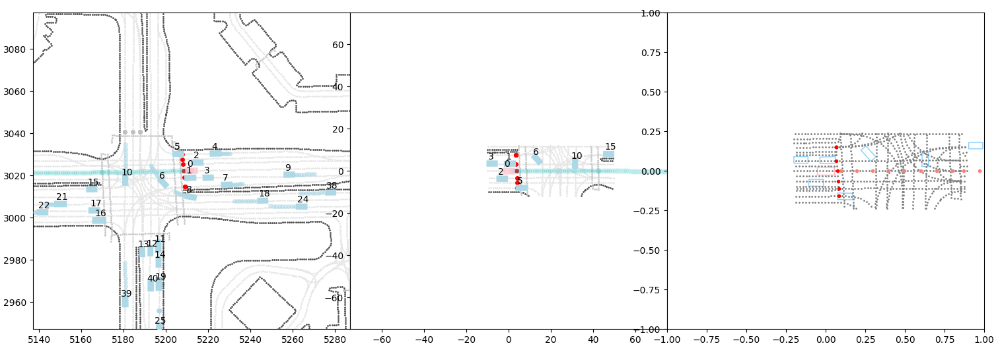
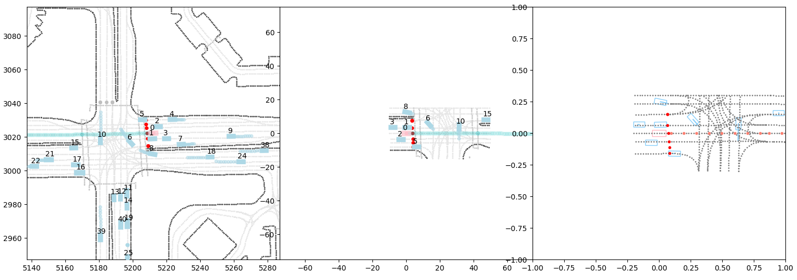
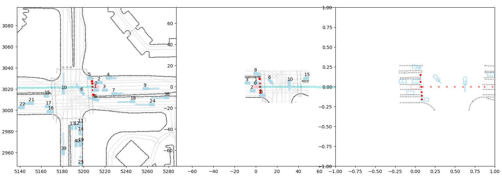
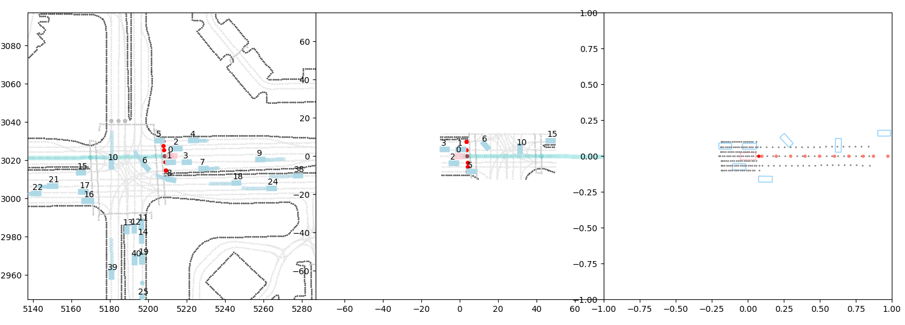

# Observation Wrappers Documentation

This document explains the observation wrappers used in V-Max and describes the role of their corresponding feature extractors.

## Observation Wrappers

Wrappers are used to apply an observation function to the environment by overriding the `observe` method with a custom transformation.

We designed several configurable observations:
- `base_observation.py`
- `lane_observation.py`
- `road_observation.py`
- `segment_observation.py`
- `gt_observation.py`

Each observation is paired with a feature extractor that converts a `datatypes.Observation` into a structured set of features for downstream processing.

We define four feature groups in `features_datatypes.py` along with their associated feature types:

- **Objects** (vehicles, pedestrians, bicycles):
    - waypoints (xy)
    - velocity (vel_xy)
    - speed (speed)
    - yaw (yaw)
    - size (length, width)
    - object_types (object_types)
    - valid (valid)
- **Roadgraph Points**:
    - waypoints (xy)
    - direction (dir_xy)
    - types (types)
    - valid (valid)
- **Traffic Lights**:
    - waypoints (xy)
    - state (state)
    - valid (valid)
- **Path Target**:
    - waypoints (xy)

The common feature extraction process for each group is as follows:
- **Objects**: Dynamic objects (up to N objects, with N = max_num_objects - 1) are sorted by their distance to the SDC.
- **Traffic Lights**: A similar sorting strategy is applied.
- **Path Target**: Selects the longest SDC path containing the SDC's logged trajectory and subsamples it into N points, spaced every X meters.
- **Roadgraph Points**: Involves several steps:
    - First, select points from the SDC observation using a top_k strategy to retain a fixed number of the closest points. Alternatively, a rectangular selection filter can be applied within a specified range in front, back, left, and right of the SDC.
    - Downsample the points by a defined interval (default is 1, meaning every point is kept; using 2 means one point every two points).
    - Optionally filter the points to retain only certain types (e.g., lane center points, road lines, road edges).
    - Finally, apply a top_k operation to the remaining valid points to keep a fixed number.

In summary, roadgraph extraction follows this sequence: preselection → downsampling → filtering → selection.

### Base Observation & Extractor

The Base Observation wrapper establishes a standard interface that:
- Initializes the observation with default configurations.
- Instantiates a Base Features Extractor to set up the basic extraction functions.
- Aggregates various feature groups (objects, roadgraph points, traffic lights, and path targets) into a single concatenated observation array.

The Base Features Extractor is designed for extensibility:
- It provides default parameters for each feature group while allowing for overrides.
- It supports dynamic feature extraction and normalization.
- Its modular structure simplifies the creation of specialized extractors for different observation needs.

### Lane Observation & Extractor

The **Lane Extractor** inherits from the Base Extractor. The only difference is in its filter function, which retains only lane center points as valid.

### Road Observation & Extractor

The **Road Extractor** also inherits from the Base Extractor. Its filter function retains only road features as valid, including road boundaries and road lines.

### Segment Observation & Extractor

The **Segment Extractor** inherits from the Base Extractor but implements different extraction strategies for the roadgraph and the traffic lights:

**Roadgraph**:
    - Roadgraph points are extracted as segments, represented by points with the same identifier. The process involves selecting the N segments closest to the SDC, followed by interpolation to redefine each segment with M points.

**Traffic Light**:
    - Only one traffic light is considered, specifically the one located on the path target.

### GT Observation & Extractor

The **GT Extractor** extracts the logged trajectory of the SDC. This privileged information is useful for debugging learning algorithms by providing an easily verifiable reference.
